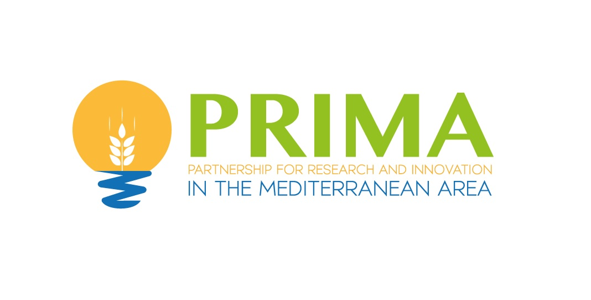
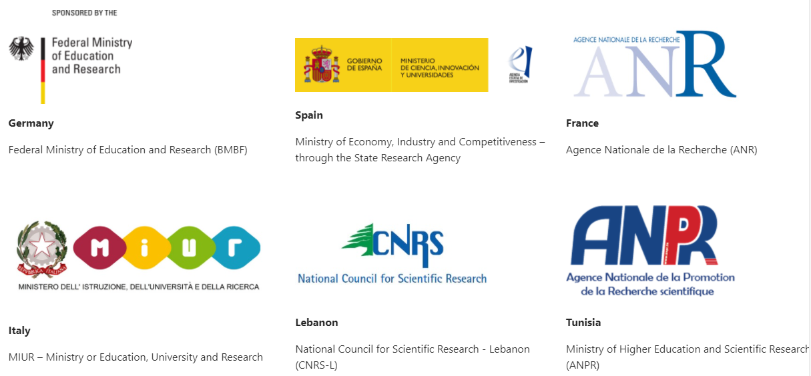

  

 

## Karst Aquifer Resources availability and quality in the Mediterranean Area

The [KARMA project](http://karma-project.org/) aims to achieve a better karst groundwater management across the scale of the Mediterranean area, single catchments and selected springs.

Artificial Neural Networks (ANN) were used as part of *Deliverable 4.3* to model time series of karst spring discharge. The example code can be found in the corresponding subdirectory. An ExampleDataset is provided that shows the structure of the input data to be used. Your own data can have any number of columns/input parameters without changing the code. The code is extensively commented and executable. However, for successful use of the model, we strongly recommend sufficient knowledge of Python and of best practices in ANN modeling! You can train your own models and use these models to predict flood and drought scenarios by swapping the input data for the test set and setting the time and date of the test set accordingly. Note that very careful model evaluation is required if the scenario data tend to leave the range of values of the training data. Use great caution when extrapolating! As a common rule, ANNs are not well suited for this purpose. This also affects the interpretation of the results if you plan to do climate impact studies based on future climate scenarios. It is possible in principle, but as mentioned, great care must be taken in modeling and application in this case. Also pay attention to the software license:   
 

  

### FUNDING

KARMA is implemented under the umbrella of the [Partnership for Research and Innovation in the Mediterranean Area (PRIMA)](https://prima-med.org/), which aims to develop new R&I approaches to improve water availability and sustainable agriculture production in a region heavily distressed by climate change, urbanisation and population growth.

The PRIMA programme is an Art.185 initiative supported and funded under [Horizon 2020](https://ec.europa.eu/programmes/horizon2020/en), the European Union’s Framework Programme for Research and Innovation.

The various project partners are each funded by their national funding institution:

