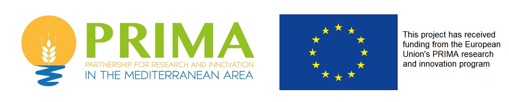

 

## Karst Aquifer Resources availability and quality in the Mediterranean Area

The [KARMA project](http://karma-project.org/) aims to achieve a better karst groundwater management across the scale of the Mediterranean area, single catchments and selected springs

Artificial Neural Network (ANN) modeling has been performed to model karst spring discharge time series. Find example code in the according subdirectory. 

  

### FUNDING

KARMA is implemented under the umbrella of the [Partnership for Research and Innovation in the Mediterranean Area (PRIMA)](https://prima-med.org/), which aims to develop new R&I approaches to improve water availability and sustainable agriculture production in a region heavily distressed by climate change, urbanisation and population growth.

The PRIMA programme is an Art.185 initiative supported and funded under [Horizon 2020](https://ec.europa.eu/programmes/horizon2020/en), the European Union’s Framework Programme for Research and Innovation.

The various project partners are each funded by their national funding institution:

